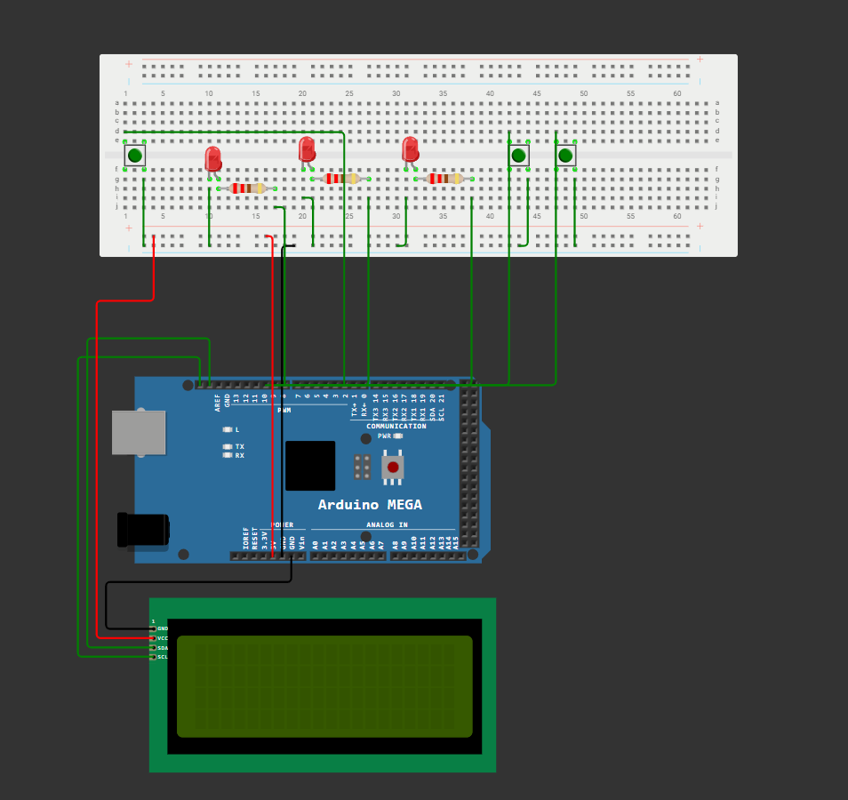

# Bare-Metal vs FreeRTOS for Real-Time IoT Microcontroller Systems

Comparing bare-metal programming (direct hardware control, no OS) against FreeRTOS (priority-based task scheduler) on an Arduino Mega 2560. This project measures response latency and memory overhead across four test conditions to determine when each approach is appropriate for IoT applications.

> **Course:** EECE 473 – OS for Computer Engineering | Manhattan University  
> **Team:** Myron Corpuz, Christian Hernandez, Michael Zadrima

---

## Real-World Applications
- Smart home automation & safety systems
- Medical wearables requiring deterministic timing
- Industrial IoT sensors with concurrent data streams
- Drone flight controllers & robotics

---

## How It Works

Two implementations were built and tested on identical hardware in Wokwi:

**Bare-Metal:** Standard Arduino `loop()`. Button checks and a CPU-intensive busy task run sequentially. Under load (500,000-iteration loop), the busy task blocks all button responses until it completes.

**FreeRTOS:** Five concurrent tasks (BTN1/2/3 at priority 3, IDLE at priority 2, BUSY at priority 1). A mutex protects shared LCD writes. The scheduler preempts the busy task instantly when a high-priority button task is ready.

**Metrics measured:** Response latency (ms), free heap memory (bytes), task execution count — logged via Serial Monitor.

---

## Circuit Diagram

---

## Results

| Test Condition | Free Memory | Response Time | Outcome |
|---|---|---|---|
| Bare-Metal – No Load | 7,422 bytes | 0 ms | ✓ Responsive |
| Bare-Metal – With Load | 7,426 bytes | ~1,005 ms | ✗ Blocked |
| FreeRTOS – No Load | ~888 bytes | 0 ms | ✓ Responsive |
| FreeRTOS – With Load | ~888 bytes | 0 ms | ✓ Preempted |

### Key Findings

| | |
|---|---|
| 🔴 Bare-Metal Latency Under Load | ~1,005 ms |
| 🟢 FreeRTOS Latency Under Load | 0 ms |
| 💾 Extra RAM Used by FreeRTOS | ~6.5 KB |

**Under CPU load, bare-metal latency surges to ~1,005 ms while FreeRTOS maintains 0 ms through priority preemption. However, FreeRTOS uses ~6,534 more bytes of RAM for its kernel and task stacks — the core trade-off.**

---

## Serial Monitor Results

### Bare-Metal – No Load

### Bare-Metal – With Load

### FreeRTOS – No Load

### FreeRTOS – With Load

---

## Challenges Faced
- Mutex required to prevent concurrent LCD writes causing garbled output
- FreeRTOS address conflict on I²C bus required careful library selection
- Wokwi simulation speed differs from real hardware timing

---

## Conclusion
Both systems perform identically without load. Under CPU load the contrast is stark — bare-metal blocks all processing until the busy task completes, while FreeRTOS preempts it instantly.

- For simple, single-task IoT devices: bare-metal is sufficient and more memory-efficient
- For multi-task, time-critical IoT systems: FreeRTOS is essential

The right choice depends entirely on application complexity and real-time requirements.

---

## Future Work
- Port to ESP32 (FreeRTOS built-in, dual-core) for deeper analysis
- Measure power consumption (mW) across all four test conditions
- Add boot time measurement as an additional performance metric
- Test with Zephyr RTOS for a three-way OS comparison

---

## Libraries Used
- `Arduino_FreeRTOS` — install via Arduino Library Manager
- `Wire.h` (built into Arduino IDE)
- `LiquidCrystal_I2C` — install via Arduino Library Manager
